<div align="center">

  <!-- Animated Typing Banner -->
  <a href="https://github.com/Achuth-u">
    
  </a>

</div>

<br />

<!-- Terminal Header / Whoami Section -->
```bash
$ whoami
```

<table align="center" width="100%" style="border-collapse: collapse; border: none; background-color: #0d1117;">
  <tr style="border: none;">
    <!-- Left Column: Animated ASCII Portrait -->
    <td width="48%" align="center" valign="top" style="border: none; padding: 5px;">
      
    </td>
    <!-- Right Column: System Info Terminal Panel -->
    <td width="52%" align="center" valign="top" style="border: none; padding: 5px;">
      
    </td>
  </tr>
</table>

<br />

<!-- Contributions Section -->
```bash
$ cat contributions.log
```

<div align="center">
  
</div>

<br />

<!-- Snake Contribution Grid Animation -->
<div align="center">
  
</div>

<br />

<!-- Projects Section -->
```bash
$ ls -la ~/projects/
```

<table align="center" width="100%" style="border-collapse: collapse;">
  <tr>
    <td width="33%" valign="top" style="background-color: #161b22; border: 1px solid #30363d; border-radius: 8px; padding: 15px;">
      <h3 style="color: #3BA8FF; margin-top: 0;">⚡ BudgetBuddy</h3>
      <p style="color: #c9d1d9; font-size: 13px;">Full-stack intelligent personal expense tracker with visual analytics, automated budget alerts, and smart reporting.</p>
      <p><code>Python</code> • <code>FastAPI</code> • <code>React</code></p>
      <a href="https://github.com/Achuth-u/BudgetBuddy">
        
      </a>
    </td>
    <td width="33%" valign="top" style="background-color: #161b22; border: 1px solid #30363d; border-radius: 8px; padding: 15px;">
      <h3 style="color: #3BA8FF; margin-top: 0;">🔗 Blockchain Voting</h3>
      <p style="color: #c9d1d9; font-size: 13px;">Decentralized, tamper-proof electronic voting platform ensuring transparent ledger verifiability and cryptographically secured ballots.</p>
      <p><code>Solidity</code> • <code>Ethereum</code> • <code>Web3.js</code></p>
      <a href="https://github.com/Achuth-u/Blockchain-Voting">
        
      </a>
    </td>
    <td width="33%" valign="top" style="background-color: #161b22; border: 1px solid #30363d; border-radius: 8px; padding: 15px;">
      <h3 style="color: #3BA8FF; margin-top: 0;">🌐 3D Interactive Portfolio</h3>
      <p style="color: #c9d1d9; font-size: 13px;">Immersive web portfolio featuring 3D shaders, real-time lighting physics, and interactive developer experiences.</p>
      <p><code>Three.js</code> • <code>React</code> • <code>WebGL</code></p>
      <a href="https://3dportfolioachuth.vercel.app">
        
      </a>
    </td>
  </tr>
</table>

<br />

<!-- Tech Stack & Skills Section -->
```bash
$ skills --list --category=all
```

<div align="center">
  <!-- Languages -->
  
  
  
  
  
  
  <br />

  <!-- Frameworks & AI -->
  
  
  
  
  

  <br />

  <!-- Tools & Environment -->
  
  
  
  
</div>

<br />

<!-- GitHub Stats Section -->
```bash
$ neofetch --stats
```

<table align="center" width="100%" style="border-collapse: collapse;">
  <tr>
    <td width="50%" align="center" style="border: none;">
      
    </td>
    <td width="50%" align="center" style="border: none;">
      
    </td>
  </tr>
</table>

<br />

<!-- Connect / Links Section -->
```bash
$ ping -c 4 achuth-network
```

<div align="center">

  <a href="https://3dportfolioachuth.vercel.app">
    
  </a>
  &nbsp;
  <a href="https://linkedin.com/in/achuth-u">
    
  </a>
  &nbsp;
  <a href="mailto:achuth.dev@gmail.com">
    
  </a>

</div>

<br />

<div align="center">
  <!-- Visitor Counter -->
  
</div>

<br />

---

<div align="center">

```text
[SYSTEM MONITOR] Status: ALL_SYSTEMS_OPERATIONAL // Achuth-u Cyber Profile
```

</div>
